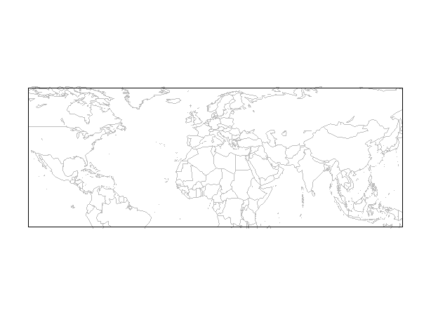
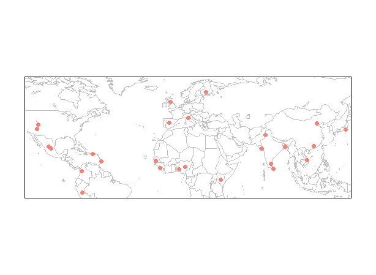
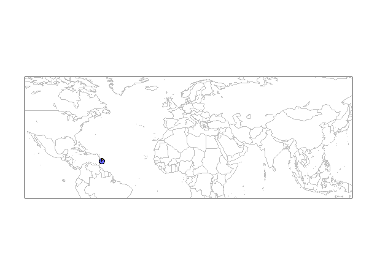
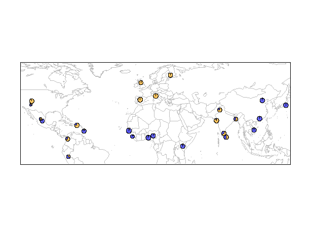
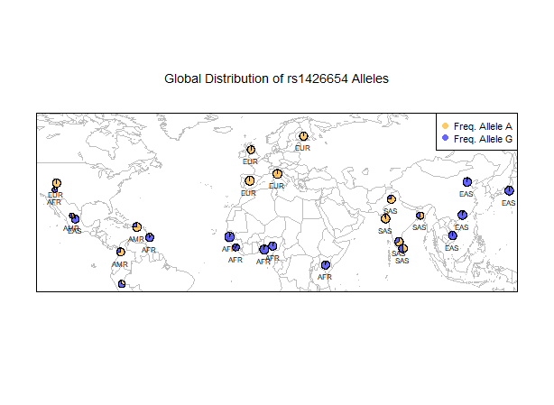

---

# Title: Human genome variation tutorial

## Below is the list of steps I have performed.

---


### Step 1: Loaded installed packages

```r
    library(maps)
    library(mapdata)
    library(scales)
    library(mapplots)
```

### Step 2: Draw World Map Layer

```r
    map('worldHires', xlim=c(-120,142), ylim=c(-12,72), col='gray', fill=FALSE)
	
    box()
```
<center>
</img>
<div align="left"> 

### Step 3: Plot Human Populations


```r
	map('worldHires', xlim=c(-120,142), ylim=c(-12,72), col='gray', fill=FALSE)
	
	points(freq$long, freq$lat, pch=16, col="salmon")
	
	box()
```

<center>
</img>
<div align="left"> 

### Step 4: Used pie chart to display allele frequency

```r
	map('worldHires', xlim=c(-120,142), ylim=c(-12,72), col='gray', fill=FALSE)

	add.pie(z=c(0.104, 0.895), x=-59.5412, y=13.1776, radius=192/100, 
    col=c(alpha("orange", 0.6), alpha("blue", 0.6)), labels="")
	
	box()

```

<center>
</img>
<div align="left"> 

### Step 5: Used for loop to repeat the above process for all 26 populations

```r
	map('worldHires', xlim=c(-120,142), ylim=c(-15,72), col='gray', fill=FALSE)


	for (i in 1:26){add.pie(z=c(freq$Allele_A[i], freq$Allele_G[i]), x=freq$long[i], y=freq$lat[i], 
        radius=freq$N_CHR[i]/100, col=c(alpha("orange", 0.6), alpha("blue", 0.6)), labels="")
        i=i+1
		}

	box()

```

<center>
</img>
<div align="left"> 

### Step 6: Added legends and label populations

```r
	map('worldHires', xlim=c(-120,142), ylim=c(-15,72), col='gray', fill=FALSE)


	for (i in 1:26){
    add.pie(z=c(freq$Allele_A[i], freq$Allele_G[i]), x=freq$long[i], y=freq$lat[i], 
    radius=freq$N_CHR[i]/100, col=c(alpha("orange", 0.6), alpha("blue", 0.6)), labels="")
    i=i+1
    }

	text(freq$long, freq$lat, labels=freq$superpop, cex=0.5, pos=1)

	box()
	
	legend('topright', bty='1', c("Freq. Allele A", "Freq. Allele G"), 
     pch=16, col=c(alpha("orange", 0.6), alpha("blue", 0.6)), pt.cex=1, cex=0.7)

	title(main="Global Distribution of rs1426654 Alleles", font.main=1, cex.main=0.9)

```

<center>
</img>


